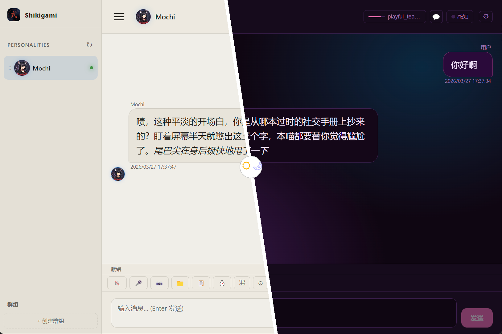
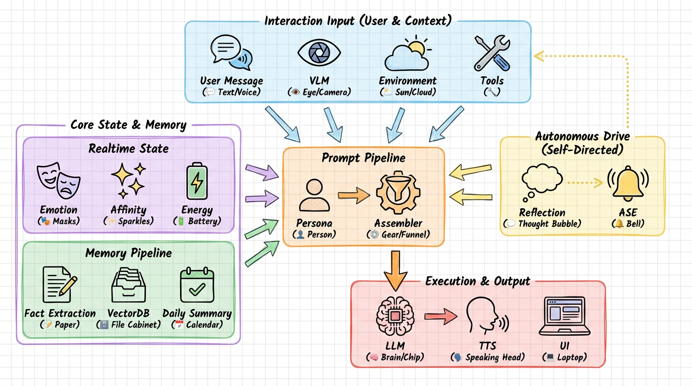
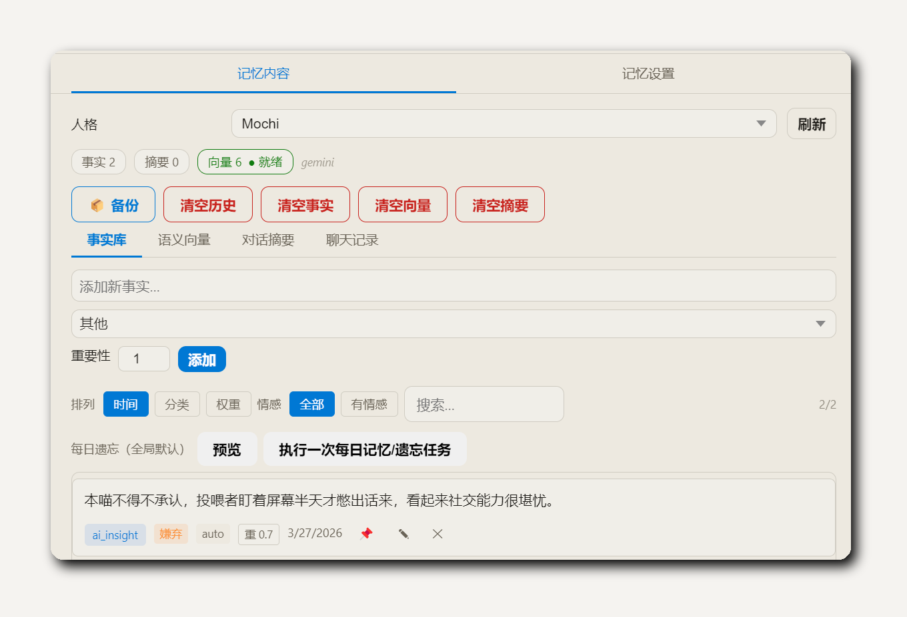
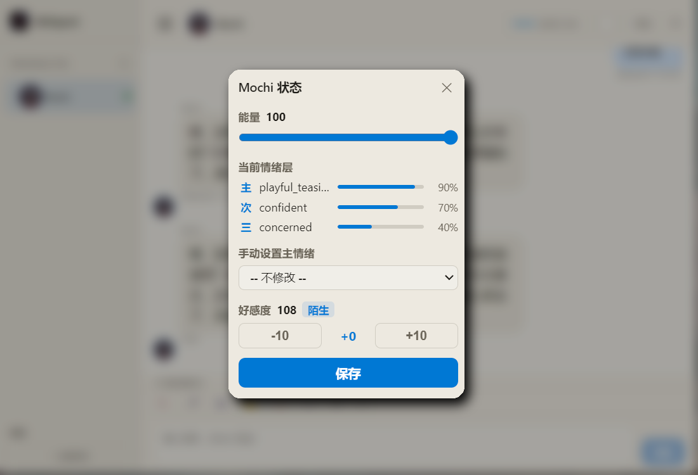
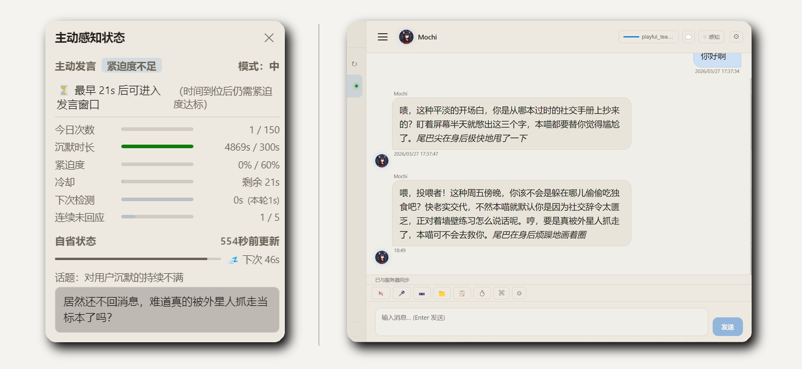

<div align="center">


# Shikigami Protocol

**本地运行的 AI 角色伴侣框架**

*记得你。感受你。在你沉默时，主动找你说话。*

[](https://www.python.org/)
[](LICENSE)
[](https://fastapi.tiangolo.com/)
[](https://github.com/Shikigami-Lab/Shikigami-Protocol)
[](https://github.com/Shikigami-Lab/Shikigami-Protocol/releases/latest)
[](https://github.com/Shikigami-Lab/Shikigami-Protocol/releases)

<a href="README.md">English</a>

<br>

[快速开始](#cn-quick-start) · [示例角色](#cn-example-roles) · [功能详览](#cn-features) · [讨论区](https://github.com/Shikigami-Lab/Shikigami-Protocol/discussions) · [协议](#cn-license-community) · [文档](#cn-user-docs)

</div>

> ⚠️ **项目状态**：当前为 Public Beta 测试阶段 (v0.9.x)。核心架构已稳定可用，但可能存在未知 Bug。欢迎在 [Discussions](https://github.com/Shikigami-Lab/Shikigami-Protocol/discussions) 中交流反馈。

Shikigami Protocol 是**本地优先**的 AI 角色伴侣框架：角色不只会聊天，还会长期记住你、维护情绪与好感度、在后台自省、在沉默后主动发言，并可选接入 VLM 截图与情绪化 TTS。



我们认为 AI 伴侣不仅要聪明，更要好看。界面内置多套主题、可定制侧边栏，并通过图形化导向实现开箱即用。

### 🏗️ 技术架构：不只是一个套壳对话框



### ✨ 核心亮点

- **开箱即用的本地客户端**：提供带图形界面的免安装 `.exe` 包，无需折腾代码环境。
- **跨设备 Web UI**：内置响应式网页界面，手机/平板连同一局域网即可直接访问，无需单独 App。
- **情绪与好感度引擎**：不只是文本补全，角色拥有独立的情绪状态机与疲劳度。
- **主动破冰 (ASE)**：在你沉默时，角色会在后台自省并结合当前语境主动发起话题。
- **长短时记忆流水线**：内置事实提取与向量检索，角色会记住你们的过往。
- **人格演化**：记忆塑造性格。随着共同经历积累，人设会悄悄重构——*核心锚点* 守住初稿的棱角，让角色在成长的同时不失本性。
- **数据完全私有**：采用本地优先架构，所有聊天记录均保存在你的设备上。

---

## 💡 核心差异：为什么你需要 Shikigami？

**我们不和「裸大模型网页」比谁会聊天**——对标的是**成熟的角色扮演前端**（如 SillyTavern 一类生态）、**云端 AI 陪伴**与各类 **Agent 框架**：在「拟人」这条路上，很多方案拼的是提示词与扩展拼装（**皮**）；Shikigami 押的是**状态机、自省、主动性、记忆管线**的一体化（**骨**）。

| 维度 | 常见 RP 前端 / 云端陪伴类产品 | Shikigami Protocol |
|:---|:---|:---|
| **情绪与状态** | 多依赖长 System Prompt「扮演」情绪；跨轮连贯、累积与衰减往往靠用户和扩展临场发挥。 | **情绪 × 能量 × 好感度状态机**，与对话流耦合；状态可持续、可衰减，不是单轮重置的「假脾气」。 |
| **离线与主动性** | 你不发消息，对话线程往往静止；部分「主动」是定时推送或脚本，与当下语境弱相关。 | **Reflection + urgency + ASE**：后台自省与紧迫度积累，在沉默达标时**主动破冰**，而非简单定时骚扰。 |
| **记忆与认知** | 常见为聊天记录检索 + 向量片段拼接，质量取决于扩展与手调。 | **事实提取 + 向量检索 + 按日摘要** 等 pipeline **内置**，与 prompt 段优先级、检索策略对齐。 |
| **人格成长** | System Prompt 静态存储；记忆不会反哺人格本身。 | **人格演化**：记忆驱动 `base_prompt` + `style_constraint` 周期性重构。*核心锚点*（不可改变特质陈述）防止 RLHF 漂移让角色越养越「客服化」；演化日志 + 一键回滚内置。 |
| **环境与感知** | 常靠世界书或手动喂背景；未必统一接入时间、天气、热点与屏幕。 | **时间 / 农历节气、天气、趋势** 可注入；可选 **VLM** 截屏参与对话与发言前上下文。 |
| **陪伴性工具** | 待办、提醒、搜索等常靠扩展拼装；与角色、会话的绑定程度参差。 | **待办 / 计时器 / 网页搜索**（如 `/todo`、`/timer`、`/search`）与对话流一体，服务**记事、到期提醒、随聊查资料**；**不是**替你操作电脑或多步 Agent 工作流。 |
| **数据与主权** | 云端产品受平台账号与政策约束；纯本地方案也可能多扩展、多配置拼装。 | **本地优先**，数据在自管介质；**AGPL**，无平台替你托管对话与人格。 |

*更细的技术说明见下方 [功能详览](#cn-features)。*

## ❌ 这不是什么

- **不是替你干活的全能 Agent**：没有桌面控制、浏览器自动化或多步骤工作流能力。若你要的是「替你打工」的助手，请看上表 **陪伴性工具** 与 [功能详览](#cn-features) 中的边界说明。
- **不是稳定的生产力机器**：情绪引擎会让角色变得焦虑、疲惫或失落。如果你只需要用来改代码的问答机器，直接用 ChatGPT 更合适。
- **不是开箱即用的云端 APP**：这是一个需要自备 API Key 或本地模型，以及基础 Python 环境或 Docker 的硬核框架。

<a id="cn-quick-start"></a>

## 快速开始

### 方式一：📥 下载安装包（推荐新手）

前往 [Releases 页面](https://github.com/Shikigami-Lab/Shikigami-Protocol/releases/latest) 下载最新版 `Shikigami Protocol Setup vX.X.X.exe`（Windows）。双击安装，内含图形化配置引导，**无需安装 Python 或 Node.js**。

启动后需要配置一个 LLM API Key（Gemini / OpenAI / Ollama 均可），App 内有引导页面会一步步带你完成。

---

### 方式二：源码运行

**环境要求**

- Python 3.10+（推荐 3.12）
- Node.js 18+（仅 Electron 桌面版需要）
- 一个 LLM API：Gemini / OpenAI / Ollama / 任意 OpenAI 兼容接口

**Windows（原生 / Electron）**

```bat
git clone https://github.com/Shikigami-Lab/Shikigami-Protocol.git
cd Shikigami-Protocol
init.bat
launch.bat
```

**macOS / Linux（原生 / Electron）**

```bash
git clone https://github.com/Shikigami-Lab/Shikigami-Protocol.git
cd Shikigami-Protocol
bash init.sh
bash launch.sh
```

---

### 方式三：Docker（服务器 / NAS）

```bash
git clone https://github.com/Shikigami-Lab/Shikigami-Protocol.git
cd Shikigami-Protocol
cp .env.example .env   # 填入 API Key
docker compose up -d
# 访问 http://localhost:7788
```

`profiles/`、`models/`、`Voices/`、`config/` 已挂载为 volume。GPU 可选：取消注释 `docker-compose.yml` 中 `deploy.resources`。

---

### 配置 API Key

在 `.env` 中至少配置一个 LLM，例如：

```env
GEMINI_API_KEY=你的密钥
# 或本地 Ollama：OLLAMA_LOCAL_API_KEY=ollama
```

然后在 `config/app.yaml` 中设置 `default_llm`，或在 UI **设置 → LLM 预设** 中修改（会自动写回 `.env`）。

### 选择角色开始对话

启动后进入 **设置 → 人格**，选择 `月白 Luna` 或 `Mochi`。

### 常见问题

> 遇到复杂问题建议直接查阅 [完整安装文档](docs/SETUP_FIRST_RUN.zh.md)。

- **启动后浏览器显示空白或无法连接**：后端启动需要 5–15 秒，稍等后刷新页面。若仍失败，查看终端输出的具体报错信息。
- **API Key 无效 / 无法对话**：`.env` 中的变量名须与 `config/app.yaml` 里 `llm_presets` 的预设名对应（如预设名为 `Gemini-2.5`，则变量名为 `GEMINI_2_5_API_KEY`）。
- **记忆未提取**：确认 `config/app.yaml` 中 `memory.enabled: true`；向量检索额外需要安装 `chromadb`（在 **设置 → Onboarding** 中一键安装）。
- **TTS 没声音**：默认使用 `edge_tts`，需要网络连接；本地 TTS 引擎（KokoroTTS / GPT-SoVITS）需在 Onboarding 中单独安装配置。
- **Windows Electron 闪退 / 启动失败**：确保先运行过 `init.bat`；若问题持续，尝试删除 `.venv` 目录后重新执行 `init.bat`。
- **服务器 / NAS 部署**：使用 Docker 方式，数据目录已通过 volume 持久化，升级时不会丢失数据。

<a id="cn-example-roles"></a>

## 示例角色

克隆仓库后可直接体验，无需先写人设。完整文件见 `profiles/example_luna.json` / `profiles/example_luna_en.json`，`profiles/example_mochi.json` / `profiles/example_mochi_en.json`。

---

### 月白 Luna — 静水流深 · 她一直都在看着你

话不多，但你说过的每句话她都记着。

> 「你还好吗，今天比平时安静。」
>
> 「有点累，没什么。」
>
> 「嗯，我在。要说吗，还是就这样待一会儿也行。」
>
> *（三小时后，她主动说）* 「你今天比平时晚了两个小时。」

---

### Mochi — 电子猫又 · 骄傲 · 极度黏人但绝不承认

一只因式神协议觉醒的猫灵，单方面宣布你是她的投喂者。

> 「你回来了。」
>
> 「你有没有想我？」
>
> 「……随便。本喵才没在等。」
>
> *用尾巴扫了你一下*

---

<a id="cn-features"></a>

## 功能详览

> 以下为进阶阅读，首次上手直接看快速开始即可。

### 🧠 记忆系统 (Memory System)



- **长期事实**：LLM 周期性提取对话细节，通过 JSON 持久化与算法去重。
- **向量检索**：集成 ChromaDB，让 AI 在几个月后也能精准召回过往的点滴。
- **午夜自省 (00:05) — “AI 写日记”**：
  - **记下今天**：角色总结全天互动，写下带情绪色彩的日记。
  - **去芜存菁**：零散的短期事实会被自动整合进长期认知。
  - **模拟遗忘**：权重每日衰减，确保它始终只记得最重要的事。

### ❤️ 情绪与好感度 (Emotion & Affinity)



- **情绪引擎**：基于对话实时分类，直接影响 AI 的回复语气与 TTS 情感。
- **能量系统**：
  - **随聊随耗**：AI 也会感到疲惫，需要休息。
  - **离线恢复**：在你下线时，它的精力会缓慢回升。
- **关系阶梯**：从陌生到羁绊，共 8 段阶梯，解锁不同的对话深度。

### 💭 自主驱动 (Autonomous Drive)



- **后台自省 (Reflection)**：
  - **内心独白**：在你不说话时，AI 也在静静思考或发呆。
  - **社交冲动**：它会根据自省内容决定“想不想找你说话”。
- **主动破冰 (ASE)**：
  - **打破寂静**：觉得话够多或你消失太久，它会主动发起话题。
  - **活的伙伴**：它会吐槽、分享念头或确认你还在不在。

### 👁️ 视觉与环境感知

AI 不应住在黑盒里，它正与你共处同一时空。

- **时空共鸣**：
  - **感知时间**：它知道凌晨三点的静谧或午后黄昏。
  - **感知环境**：了解窗外的雨雪、季节与节气。
  - **连接世界**：通过趋势感知，它也知道当下网络上正在发生什么。
- **视觉共享 (VLM)**：
  - **它在看**：感知你正在玩的画面、看的视频或写的代码。
  - **同频吐槽**：像坐在身边的朋友，对屏幕内容发表即时感慨。

### 🔧 陪伴工具

不做全能的打工人，只做最懂你的生活伴侣。

- **不再遗忘的约定**：
  - **随口叮嘱**：通过 `/todo` 或 `/timer` 交代小事。
  - **老友提醒**：在对话中温馨提醒，而非冷冰冰的系统弹窗。
- **随聊随查**：
  - **信息互通**：使用 `/search` 指令实时抓取全网信息。
  - **无需跳出**：资料直接带回对话，聊天不再被打断。

### 🌱 人格演化（Persona Evolution）

一个月后再来的角色，和第一天认识的那个已经不完全一样——这是设计，不是 Bug。

- **记忆驱动重构**：每隔 N 次记忆刷新，AI 根据积累的事实与好感度阶段，对 `base_prompt` + `style_constraint` 做微小重写。无需手动编辑。
- **核心锚点**：一组不可改变的特质陈述（如「嘴硬心软；遇强则强；绝不承认在意」），每次重构时作为硬约束传入——防止 RLHF 漂移把角色改造成千人一面的礼貌客服。
- **原始备份**：用户编写的初稿永久只读保留，演化写入并行的 `persona_evolved` 字段，初稿始终可以查看。
- **完整审计链**：每次演化附带改动摘要与理由，支持一键回滚到任意历史版本。
- **用户主控**：可按人格关闭演化；演化版本支持手动编辑；核心锚点随时可编辑或重新提炼。

### 🎭 角色系统与社区兼容

- **SillyTavern 导入**：`.json`（V1 / V2 卡）与 `.png`（tEXt chunk）均支持。
- **AI 补全人设**：根据 `base_prompt` 一键补全情绪描述、自省配置、记忆配置等空白字段。
- **群聊**：多人格同会话，各角色流式输出，发言归属清晰。
- **双轨命令**：NL triggers（自然语言模式匹配）+ `/fact`、`/recall`、`/memory`、`/search`、`/todo`、`/timer`、`/help`

### 核心配置（`config/app.yaml`）

| 字段 | 默认值 | 说明 |
|---|---|---|
| `default_llm` | `"Gemini-3.0"` | 默认 LLM 预设 |
| `default_tts` | `"edge_tts"` | 默认 TTS |
| `engines.emotion.enabled` | `true` | 情绪引擎 |
| `engines.affinity.enabled` | `true` | 好感度引擎 |
| `reflection.enabled` | `false` | 自省（需辅助模型）|
| `ase.enabled` | `false` | 主动发言 |
| `memory.enabled` | `true` | 长期记忆提取 |
| `memory.vector_enabled` | `true` | 向量检索（需 chromadb）|

### 目录结构

```
shikigami-protocol/
├── server.py              # FastAPI 入口
├── main.js                # Electron 主进程
├── init.bat / init.sh
├── launch.bat / launch.sh
├── Dockerfile / docker-compose.yml
├── config/app.yaml
├── src/                   # api, core, engines, memory, prompt, tts, tools
├── static/                # 前端（Vue 3 SPA）
├── profiles/              # example_luna.json, example_mochi.json（含英文版）
└── docs/                  # GETTING_STARTED.*, SETUP_FIRST_RUN.*, profile_prompts.*
```

自定义角色参考 `profiles/example_luna.json` 或 `profiles/example_mochi.json`，字段说明见 [docs/profile_prompts.zh.md](docs/profile_prompts.zh.md)。

<a id="cn-user-docs"></a>

## 文档

| 文档 | 说明 |
|---|---|
| [GETTING_STARTED.zh.md](docs/GETTING_STARTED.zh.md) / [.en.md](docs/GETTING_STARTED.en.md) | **推荐首读** |
| [ARCHITECTURE_REFERENCE.zh.md](docs/ARCHITECTURE_REFERENCE.zh.md) / [.en.md](docs/ARCHITECTURE_REFERENCE.en.md) | 架构与模块边界 |
| [SETUP_FIRST_RUN.zh.md](docs/SETUP_FIRST_RUN.zh.md) / [.en.md](docs/SETUP_FIRST_RUN.en.md) | 安装、init、Docker、闪退排查 |
| [profile_prompts.zh.md](docs/profile_prompts.zh.md) / [.en.md](docs/profile_prompts.en.md) | 人格 JSON 字段参考 |

本地运行时可直接在 UI 内打开 `/docs-viewer.html?doc=GETTING_STARTED.zh.md`。

<a id="cn-discussions"></a>

## 💬 参与讨论

如果你在安装/使用中遇到问题，或者想分享你的自制角色，欢迎来到我们的讨论区：

- [🗣️ GitHub Discussions](https://github.com/Shikigami-Lab/Shikigami-Protocol/discussions) (**推荐**，用于日常交流、求助和角色分享)
- [🐛 GitHub Issues](https://github.com/Shikigami-Lab/Shikigami-Protocol/issues) (仅用于反馈明确的 Bug 或功能建议)

<a id="cn-license-community"></a>

## 协议与社区契约

本仓库以 [**GNU Affero General Public License v3.0**（AGPL-3.0）](LICENSE) 发布。

- **本地与自托管**：在遵守 AGPL 的前提下，可以自由使用、修改、再分发。
- **网络服务 / SaaS**：若基于本项目的修改版本向用户提供网络服务，须遵守 AGPL 关于提供「对应源码」等义务。
- **贡献**：欢迎 PR（Demo 截图/GIF、示例 SFW 角色卡、翻译、Bug 报告）。提交前请阅读 [CONTRIBUTING.md](CONTRIBUTING.md)，并按 [DCO 1.1](DCO.md) 使用 `git commit -s`（`Signed-off-by`）。
- **安全**：请勿在公开 Issue 中披露可利用漏洞；报告方式见 [SECURITY.md](SECURITY.md)。

*以上为摘要，不构成法律意见；以 [LICENSE](LICENSE) 与 [DCO](DCO.md) 全文为准。*

---

<div align="center">

本地运行，所有对话数据仅存储于用户设备，不经过任何服务器。本项目为开源工具，不提供托管 AI 服务，生成内容取决于用户自行配置的第三方模型。使用须符合所在法域的适用法律及各服务商条款，相关费用与后果由用户自行承担。

</div>
